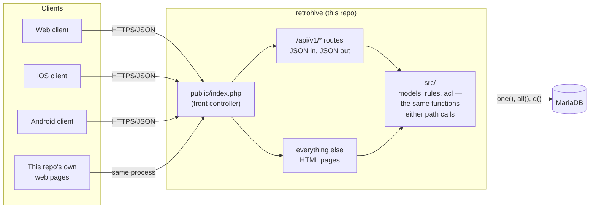
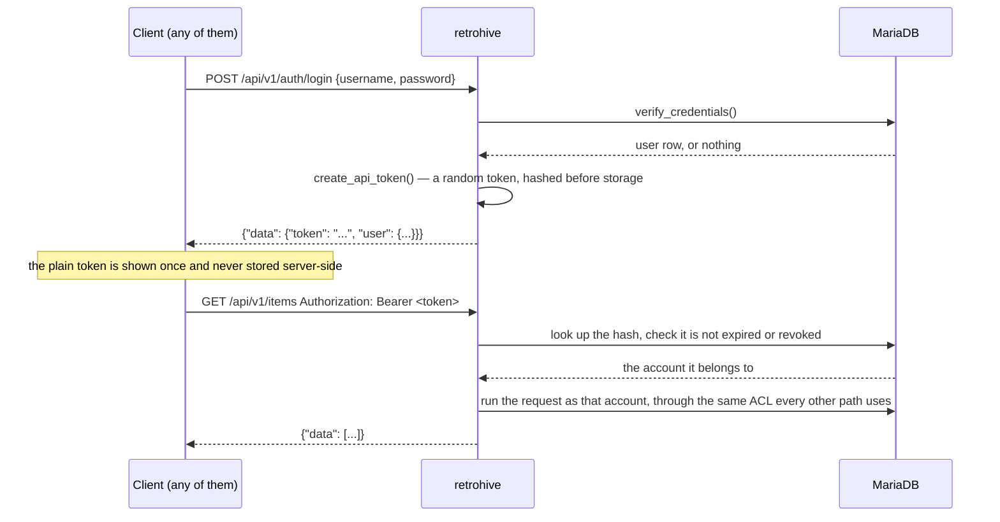
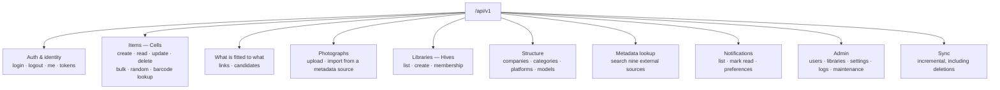
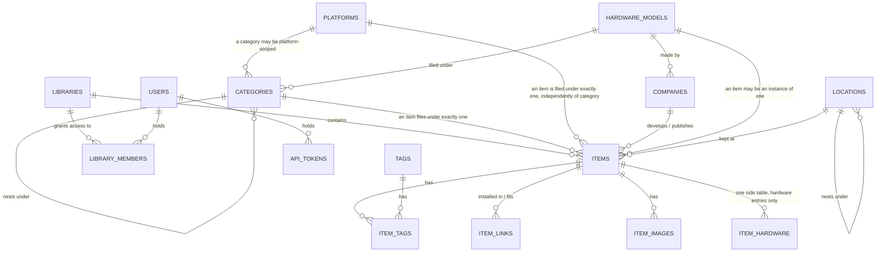
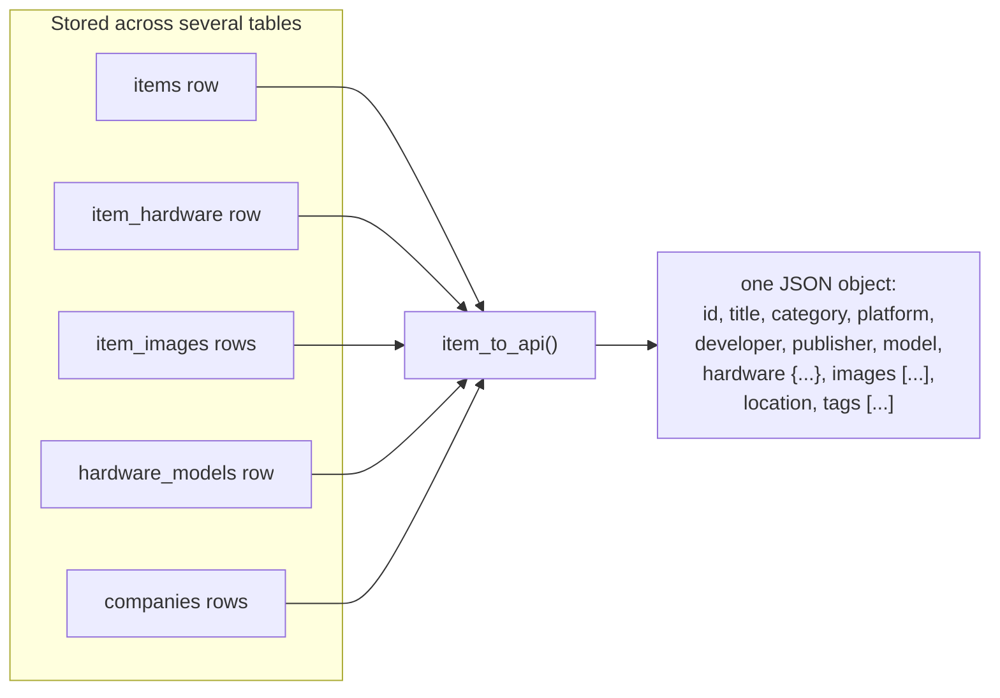

# RetroHive

A self-hosted catalogue for a retro computing collection. PHP 8.3, MariaDB, no build step, no
JavaScript framework. GPL v3.0.

Renamed from RetroVault, on GitLab and GitHub alike — see `CHANGELOG.md` for what that took and
the one manual step it left on the live server.

## Clients

- [retrohive-clients-web](https://github.com/norrorthoarders/retrohive-clients-web) — the
  browser client, a prototype rebuilt as an API consumer (see its own `MIGRATION.md`)
- [retrohive-clients-ios](https://github.com/norrorthoarders/retrohive-clients-ios) — the
  iPhone client
- [retrohive-clients-android](https://github.com/norrorthoarders/retrohive-clients-android) —
  the Android client

Every client speaks the same protocol: HTTPS, JSON, a bearer token in `Authorization`. Nothing in
this API is web-client-only.

## How a request reaches the database

One PHP application today, not yet split into a separate headless service — `public/index.php`
routes to either the JSON API or the HTML pages, and both call the same `src/` functions, which
call MariaDB directly. `retrohive-clients-web`'s own `MIGRATION.md` is the record of what a real
split would take.



## Authentication and trust

A password is sent exactly once, to sign in. Everything after that is a bearer token — the same
mechanism for every client, including this repository's own web pages, which hold a token in the
session rather than a raw password.



Revoking a token (`DELETE /api/v1/tokens/{id}`, or signing out) invalidates it immediately —
nothing client-side needs to expire on its own for a revoked session to stop working.

## What the API provides

59 routes, grouped by what they're for. `docs/openapi.yaml` is the exact, current contract;
this is the shape of it.



## The data

The core of it — every table that actually matters to a client is reachable from `items`.



`hardware_models` is what tonight's naming work calls **Foundation** — the canonical "Amiga
2000" a specific owned `item` is an instance of. `categories` and `platforms` are two
independent axes, not one nested under the other: a Category is *what kind of thing* (Games,
Peripherals), a Platform is *which machine family* (Amiga, C64) — an item has exactly one of
each, and neither implies the other.

## What a client actually sees

The database above, shaped into JSON. `item_to_api()` is the one function that does this
translation — every client reads the same shape, whether it asked for one item or a page of a
hundred.



## Structure data

`structure/*.json` — companies, categories, platforms, models. Vocabulary an entry is filed
against, not an example of one; see `db/migrations/README.md` for why there are no migrations
yet, and `structure/` itself for what ships. Synchronised from
`github.com/norrorthoarders/retrohive-core/main/structure`, or from the copies in this checkout with
no network at all.

## Requirements

PHP 8.1+, MariaDB 10.6+ or MySQL 8+, and a webserver that can rewrite everything to
`public/index.php`. No build step, no JavaScript framework, no Node.

## Installing

```
mariadb -u root -e "CREATE DATABASE retrohive CHARACTER SET utf8mb4 COLLATE utf8mb4_unicode_ci;"
mariadb -u root -e "CREATE USER 'retrohive'@'localhost' IDENTIFIED BY 'a-long-random-password';"
mariadb -u root -e "GRANT ALL PRIVILEGES ON retrohive.* TO 'retrohive'@'localhost'; FLUSH PRIVILEGES;"
```

Replace `localhost` with the actual host the webserver connects from if the database runs
somewhere else, and use the same value on both the `CREATE USER` and `GRANT` lines - a
mismatch between the two silently creates a user nothing can log in as. Already have a user
and just need to reset its password instead of creating one from scratch?

```
mariadb -u root -e "ALTER USER 'retrohive'@'localhost' IDENTIFIED BY 'a-new-password'; FLUSH PRIVILEGES;"
```

```
cp src/config.local.php.example src/config.local.php   # edit the database section
php bin/install.php --interactive
```

`docs/INSTALL.md` has the rest - including how to check what got created:

```
mariadb -u root -e "SELECT User, Host FROM mysql.user WHERE User = 'retrohive';"
```

`docs/openapi.yaml` is the API contract clients are written against.

## Checking a deployment

```
curl https://your-instance/status
```

Up or down, database connectivity, nothing more - safe to leave permanently public. For which
build actually landed and when, set `debug_status => true` in `config.local.php` and the same
information appears at `/status/debug`, plus a build number and deploy timestamp. Off by default,
and off means 404, not refused - a stranger probing the instance cannot tell the difference
between "no such address" and "turned off."
